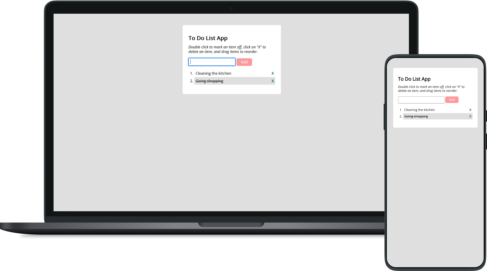

# To-Do-List-App

&nbsp;

  

&nbsp;

A simple To-Do-List-App, for an exercise to convert vanilla JavaScript code into jQuery. Converting this app was part of my [CF Full-Stack Web Development Program](https://almanowski.github.io/to-do-list-app/).

Live Demo [here](https://almanowski.github.io/to-do-list-app/).

&nbsp;

## 📝 Objective
Convert the JavaScript code into jQuery. The HTML and CSS files were prefabricated by CF. 

&nbsp;

## 🗝️ Key Features
* The user can add a new item to a list of items.
* The user can cross out an item from the list of items.
* The user can delete an item from the list of items.
* The user can change the order of items in the list of items.

&nbsp;

## 💻 Technologies Used
* HTML, CSS, JS
* jQuery

